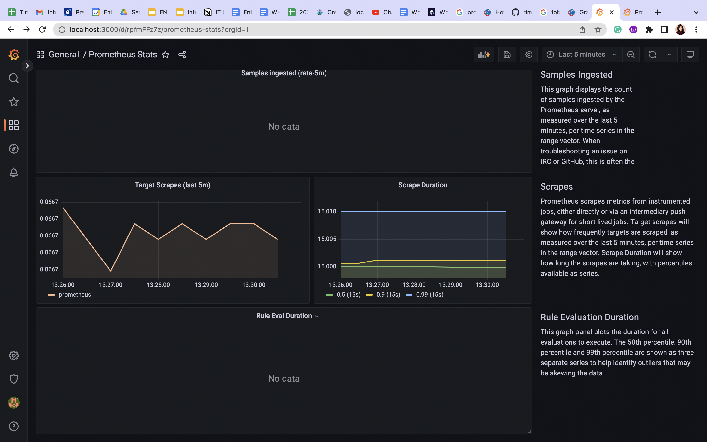
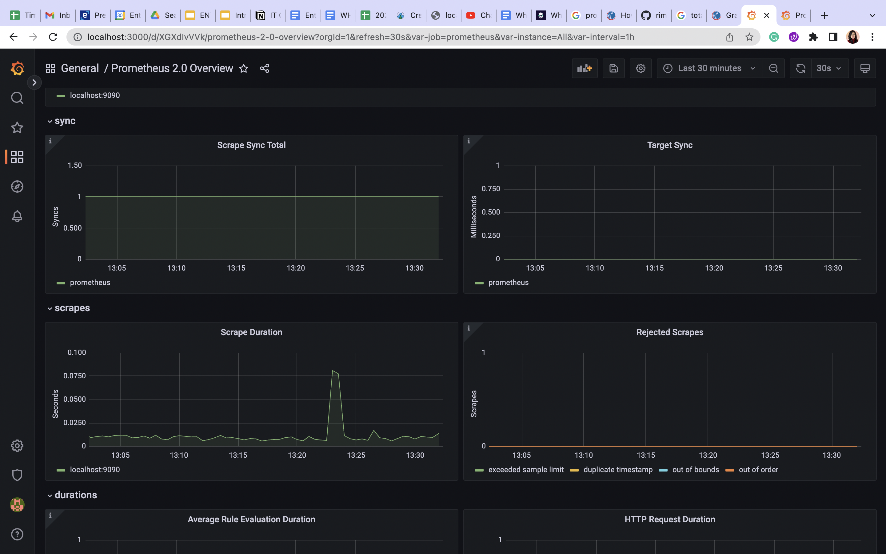
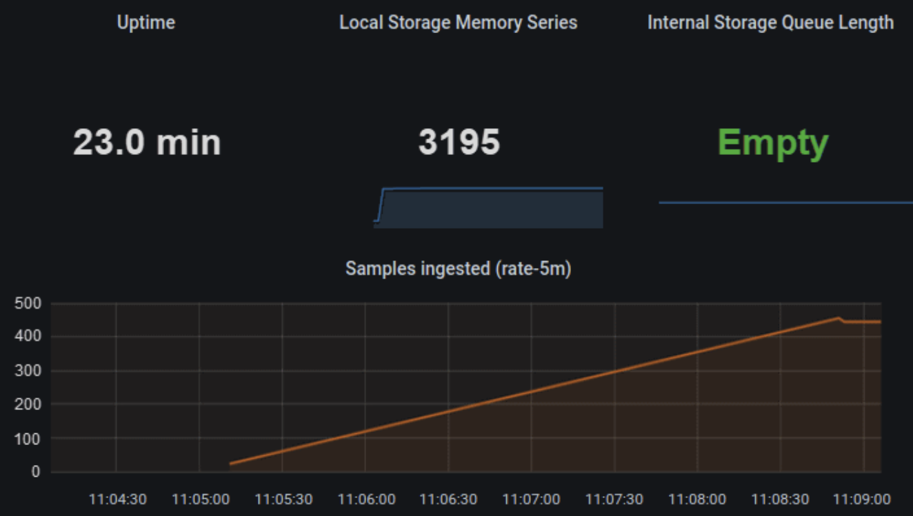
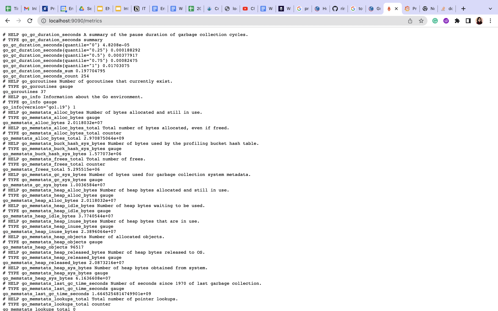

## prometheus-grafana-demo

Goal: To create a demo grafana dashboard that pulls up prometheus metrics

Steps:

1. Create a config map to store configuration values for `grafana-datasource-config.yaml`.

2. Apply changes to the above file using below command:

```
kubectl create -f grafana-datasource-config.yaml
```

3. Create a yaml file `deployment.yaml` for deploying grafana and another file named `service.yaml` to configure grafana service.

4. After step 3, apply both to kubernetes cluster with the same command as of step 2.

5. Refer to this image for the commands:


After these are done locally, use the kubectl port forwarding command to forward Grafana service to port 3000:

```
kubectl port-forward svc/grafana 3000
```

Now open a browser and navigate to http://localhost:3000/ and the grafana login screen appears.

Set up Grafana and start Prometheus locally to start collecting metrics.



This part of the dashboard shows us:

- Target Scrapes: This pannel shows panel shows the frequency of scraping the target, i.e., Prometheus, measured over the last five minutes, per time series in the range vector.
- Scrape Duration: This panel shows the duration of scrapes, measured over the same five-minute period.




This part of the dashboard shows:

- Uptime: How much time has passed since the Prometheus server was started
- Local Storage Memory Series: The number of series Prometheus currently holds in memory
- Internal Storage Queue Length: The lower this number is the better. The ‘Empty’ message means the queue number is zero.

Finally, this is what we get at http://localhost:9090/metrics when we start prometheus!


